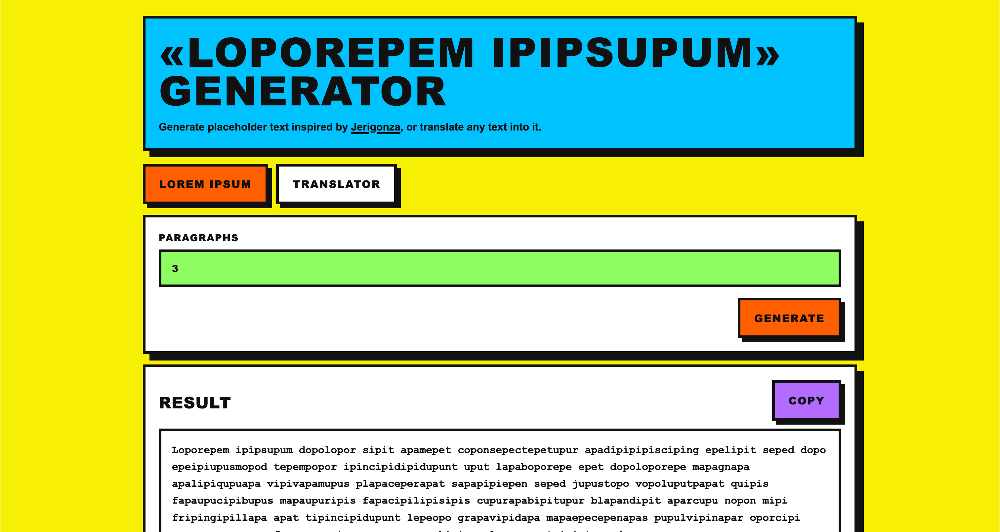

# Loporepem Ipipsupum Generator

A tiny chaotic machine that spits out placeholder text inspired by [jerigonza](https://en.wikipedia.org/wiki/Jeringonza), for when regular lorem ipsum feels a little too emotionally stable.

Live version: [josepdecid.com/loporepem-ipipsupum/](https://josepdecid.com/loporepem-ipipsupum/), already out there on the internet doing important fake-text business.

## Run locally

No dependencies, no build step, no bundler summoning ritual, no tiny goblin hiding inside `node_modules`.

Just open `index.html` in your browser and behold the nonsense.

## Deployment

This thing deploys with GitHub Pages through `.github/workflows/deploy.yml`, which is a very fancy way of saying “git push, and the weird text box goes live.”
